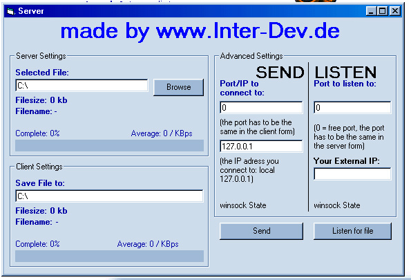



## A\+ Winsock Transfer \*NEW\* both in one form\. App & Client \- Easy\. \* A MUST HAVE\*

### Description

This is a re-make of the code I posted yesterday. Now you it consists of only one form who is able to receive and send files. You can use it to provide your app with internal filetransfer or even chats. Please visit http://www.inter-dev.de for more!

----

Thats what I posted yesterday!

" This code allows you to transfer files from one pc to another using winsock. Well it does not use only api declarations but it works. I comment it in english so i hope you can understand it because i'm german. I made that example because a lot of winsock transfer file toolkits are not precise enought. Some do not use send complete and some examples show you how your file become bigger and bigger after every transfer because they do not check the file size! I do not say that my one is perfect but much better than most of the others. For example I do not like the filesize check-routine... if you know a better way to fix that, please send me your ideas to manager@directbox.com. The "FILEINFO" routine should also made in a better way... you should take another winsock to transfer fileinfos. I also included the transfered bytes per second in that sample! "
 
### More Info
 

             |
---                |---
**Submitted On**   |2000-08-10 14:33:12
**By**             |[Hive Alien](https://github.com/Planet-Source-Code/PSCIndex/blob/master/ByAuthor/hive-alien.md)
**Level**          |Intermediate
**User Rating**    |4.7 (52 globes from 11 users)
**Compatibility**  |VB 4\.0 \(16\-bit\), VB 4\.0 \(32\-bit\), VB 5\.0, VB 6\.0
**Category**       |[Internet/ HTML](https://github.com/Planet-Source-Code/PSCIndex/blob/master/ByCategory/internet-html__1-34.md)
**World**          |[Visual Basic](https://github.com/Planet-Source-Code/PSCIndex/blob/master/ByWorld/visual-basic.md)
**Archive File**   |[CODE\_UPLOAD88188102000\.zip](https://github.com/Planet-Source-Code/hive-alien-a-winsock-transfer-new-both-in-one-form-app-client-easy-a-must-have__1-10579/archive/master.zip)

